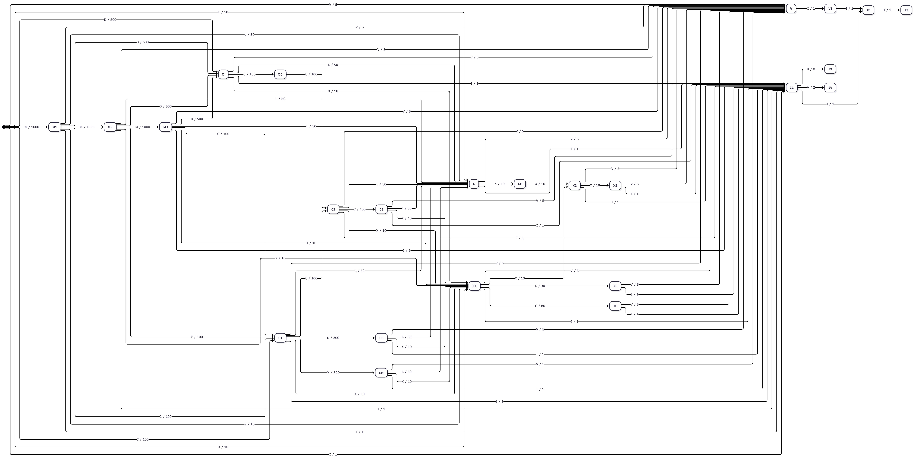

# roman-numeral-transducer

Uma implementação em Ruby de um [transdutor](https://pt.wikipedia.org/wiki/Transdutor_de_estados_finitos) para converter números romanos para decimal.

## Modelagem

O transdutor é composto por um [AFD](https://pt.wikipedia.org/wiki/Aut%C3%B4mato_finito_determin%C3%ADstico) que aceita um número romano e produz um número decimal.

### Alfabeto de entrada

$\Sigma=\lbrace I, V, X, L, C, D, M \rbrace$

### Alfabeto de saída

$\Sigma = \lbrace 0, 1, 2, 3, 4, 5, 6, 7, 8, 9 \rbrace$

## Diagrama do transdutor



> O código fonte do diagrama se encontra no arquivo `docs/diagrama.md`. Feito com [Mermaid](https://mermaid-js.github.io/mermaid/).

## Como executar

Para rodar o programa interativamente, execute:

```bash
ruby roman-numeral-transducer.rb
```

## Testes

Para executar os testes, execute:

```bash
ruby test_runner_valid.rb
ruby test_runner_invalid.rb
```
