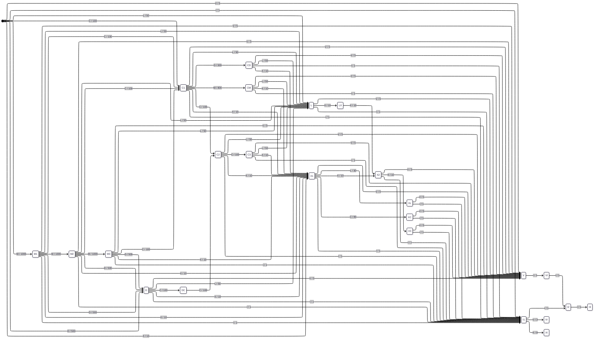

```mermaid
---
config:
  theme: redux
  layout: elk
  look: neo
---
stateDiagram-v2
    direction LR

    [*] --> M1 : M / 1000
    [*] --> D : D / 500
    [*] --> C1 : C / 100
    [*] --> L : L / 50
    [*] --> X1 : X / 10
    [*] --> V : V / 5
    [*] --> I1 : I / 1

    M1 --> M2 : M / 1000
    M2 --> M3 : M / 1000
    M1 --> D : D / 500
    M2 --> D : D / 500
    M3 --> D : D / 500
    M1 --> C1 : C / 100
    M2 --> C1 : C / 100
    M3 --> C1 : C / 100
    M1 --> L : L / 50
    M2 --> L : L / 50
    M3 --> L : L / 50
    M1 --> X1 : X / 10
    M2 --> X1 : X / 10
    M3 --> X1 : X / 10
    M1 --> V : V / 5
    M2 --> V : V / 5
    M3 --> V : V / 5
    M1 --> I1 : I / 1
    M2 --> I1 : I / 1
    M3 --> I1 : I / 1    
    
    D --> DC : C / 100
    DC --> C2 : C / 100
    D --> L : L / 50
    D --> X1 : X / 10
    D --> V : V / 5
    D --> I1 : I / 1
    C1 --> C2 : C / 100
    C1 --> CD : D / 300
    C1 --> CM : M / 800
    C2 --> C3 : C / 100
    C1 --> L : L / 50
    C2 --> L : L / 50
    C3 --> L : L / 50
    CD --> L : L / 50
    CM --> L : L / 50
    C1 --> X1 : X / 10
    C2 --> X1 : X / 10
    C3 --> X1 : X / 10
    CD --> X1 : X / 10
    CM --> X1 : X / 10
    C1 --> V : V / 5
    C2 --> V : V / 5
    C3 --> V : V / 5
    CD --> V : V / 5
    CM --> V : V / 5
    C1 --> I1 : I / 1
    C2 --> I1 : I / 1
    C3 --> I1 : I / 1
    CD --> I1 : I / 1
    CM --> I1 : I / 1

    L --> LX : X / 10
    LX --> X2 : X / 10
    L --> V : V / 5
    L --> I1 : I / 1
    X1 --> X2 : X / 10
    X1 --> XL : L / 30
    X1 --> XC : C / 80
    X2 --> X3 : X / 10
    X1 --> V : V / 5
    X2 --> V : V / 5
    X3 --> V : V / 5
    XL --> V : V / 5
    XC --> V : V / 5
    X1 --> I1 : I / 1
    X2 --> I1 : I / 1
    X3 --> I1 : I / 1
    XL --> I1 : I / 1
    XC --> I1 : I / 1

    V --> VI : I / 1
    VI --> I2 : I / 1
    I1 --> I2 : I / 1
    I2 --> I3 : I / 1
    I1 --> IV : V / 3
    I1 --> IX : X / 8
```